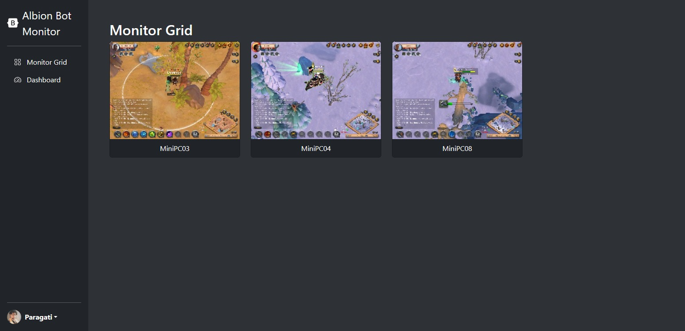
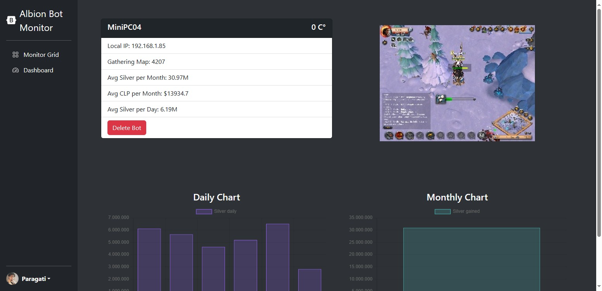
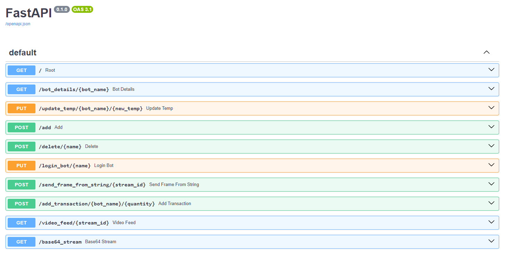

# AlbionBotsWebMonitor
Esta herramienta fue pensada como una aplicación local para monitorizar la actividad y registrar las 
estadísticas de los bots de Albion Online en las diferentes máquinas de mi granja.

## Bots Grid
En esta sección podemos ver una rejilla con todos los bots registrados en nuestra base de datos y un stream
del cliente del juego.

## Bot Details
En esta sección podemos revisar las estadísticas específicas de un bot.

## Documentación
La documentación la podemos obtener en 127.0.0.1:8082/docs

